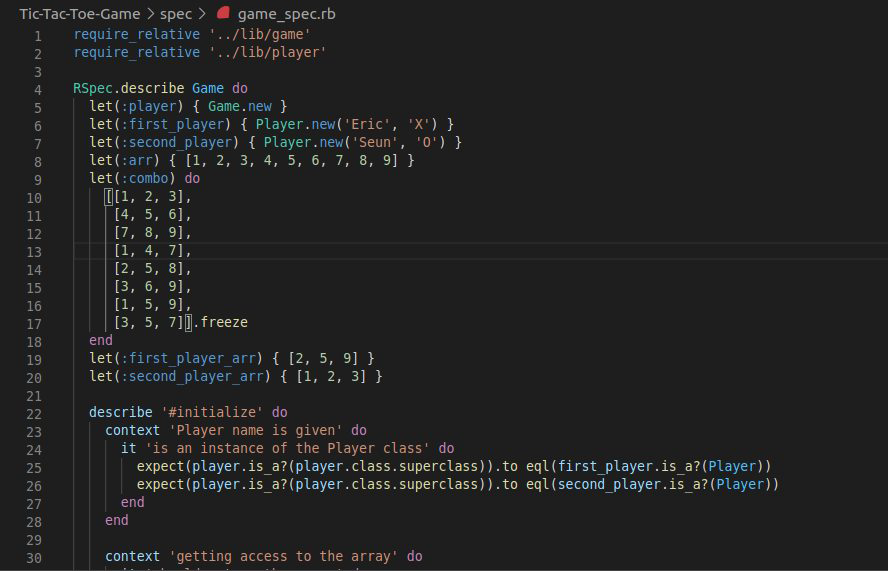

# The Tic-Tac-Toe
>The purpose of this project was to demonstrate our learned skills on Ruby programming. Here we developed the Tic-Tac-Toe game.

In this project we created an executable file on main.rb that allows the users to play the game through terminal

## How To Play

"Tic Tac Toe" is a 2 player game which includes 9 squares each of them represented with a number. Each player will be represented with a symbol ("X" or "O") and their respective symbols will overwrite the square numbers.The first player will start the game.
If after 9 turns neither player manages to put their respective symbols in a straight/diagonal line the game will end as a draw

## Build with

- Ruby
- VSCode
- Rubocop

## Getting Started

In order to play it locally follow the next steps

### Prerequisites

Ruby installed localy

### Install

1. Clone the repo into your machine
    $ https://github.com/GzimAsani/Tic-Tac-Toe-Game.git

2. Navigate to the downloaded file and click bin folder than main.rb (./bin/main.rb) or you can do this through the terminal "cd Tic-Tac-Toe-Game"

3. Type in ruby bin/main.rb in the terminal.

4. After the 3 step the game will start first by asking the two players names.

## Contents
The code is divided in two main folders **./bin**  and **./lib**.
The main executable code **main.rb**  is in **./bin**. The other folder contents other important classes which were incorporated in the **main.rb**

# Authors

👤 **Eric Enaburekhan**

- Github: [@enaburekhan](https://github.com/enaburekhan)
- Twitter: [@enaburekhaneric](https://twitter.com/enaburekhaneric)
- Linkedin: [@ericenaburekhan](https://www.linkedin.com/in/eric-enaburekhan-801a28100/)

👤 **Iyadi Oluwaseun**

- Github: [@CornerstoneII](https://github.com/CornerstoneII)
- Linkedin: [CornerstoneII](https://www.linkedin.com/in/oluwaseun-iyadi-773584b4/)

## 🤝 Contributing

Our favourite contributions are those that help us improve the project, whether with a contribution, an issue, or a feature request!

Feel free to check the [issues page](https://github.com/GzimAsani/Tic-Tac-Toe-Game/issues) to either create an issue or help us out by fixing an existing one.